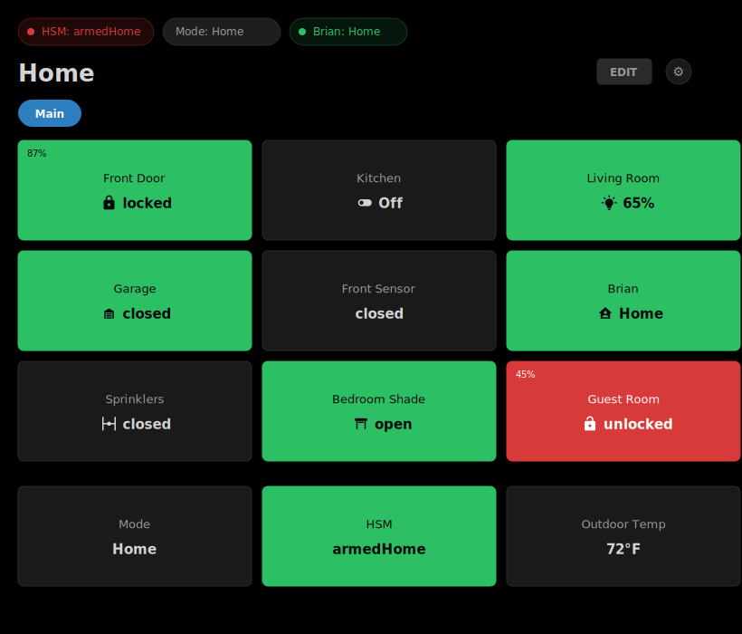
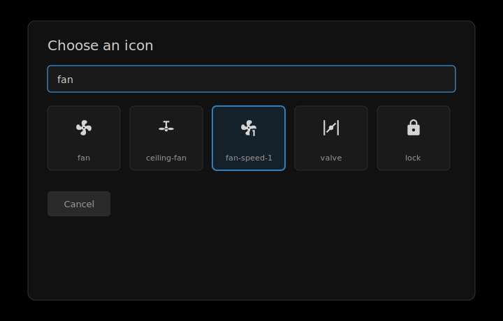

# Hubitat Dashboard (Cloudflare Worker)

Smartly-style replacement dashboard for Hubitat Elevation, hosted on Cloudflare Workers with config in KV.



*Mockup illustration of the main dashboard layout — not a live screenshot. Tile colors: green = active/safe, red = alert, gray = inactive.*

## What you get

- Single-page dashboard accessible from anywhere (phone, iPad, desktop)
- No servers to maintain — runs entirely on Cloudflare's free infrastructure
- Authentication via Cloudflare Access (Zero Trust)
- **With Cloudflare KV** (recommended): dashboard layout, tile labels, and visibility settings sync across all your devices
- **Without KV** (browser-only mode): everything stored in browser localStorage — works fine on a single device, won't follow you to another browser
- **Hub access token**: always stored in your browser's localStorage and sent directly from your browser to the Worker on each request — this is true whether or not you use KV. See [Where does my hub token live?](#where-does-my-hub-token-live) below

---

## KV or no KV?

Cloudflare KV is optional but recommended. It syncs your **dashboard config** — tile layout, labels, visibility, custom dashboards — across devices. It does **not** change where your hub access token lives; see [Where does my hub token live?](#where-does-my-hub-token-live) for that.

| | With KV (recommended) | Browser-only (no KV) |
|---|---|---|
| Dashboard layout/labels sync across devices | ✓ | ✗ (per-browser only) |
| Hub access token location | Browser localStorage (same as no-KV) | Browser localStorage |
| Requires payment method | Yes (free tier, no charge) | No |

**If you just want to try it on one device**, you can skip KV entirely — configure the dashboard, skip "Save to KV", and your settings will persist in your browser.

**If you want cross-device sync of tile layout and labels**, set up KV. Cloudflare Workers are free; KV just requires a payment method on file to enable (you won't be charged for personal-scale usage — 100k reads/day, 1k writes/day, and 1GB storage are all included at no cost).

---

## Where does my hub token live?

**Your Hubitat access token always lives in your browser's localStorage — with or without KV.** When you click "Save to Browser & Test," the token is saved locally and sent from your browser directly to the Worker as an `X-Hub-Token` header on every API request, over HTTPS. The Worker forwards it to your hub and never writes it to KV through the normal UI flow — "Save Config to KV" explicitly excludes the token, syncing only the dashboard layout (tile labels, slot mappings, visibility, custom dashboards).

This means:
- The token does **not** follow you to a different browser or device — you'll need to re-enter it there, or use [Download Config](#configuration-backup--restore) (with the "include token" option) to transfer it.
- Clearing your browser's site data for the Worker's domain removes the token and you'll need to re-enter it.
- The token is never visible to anyone without access to that specific browser's storage or your Worker's traffic.

**Advanced / legacy option**: the Worker also supports loading hub credentials from KV server-side (`{hubId}:hub-connection`), so the token never touches any browser at all. This isn't wired into the settings UI — it's set via `wrangler kv key put` from the CLI (see [Common commands](CLAUDE.md#common-commands) in CLAUDE.md) for setups where you don't want the token in any browser's storage, e.g. a shared kiosk display. When present, the Worker only falls back to this KV-stored token if the browser doesn't send an `X-Hub-Token` header.

---

## Before you start

### Cloudflare account

You need a free [Cloudflare account](https://dash.cloudflare.com/sign-up). Cloudflare hosts the Worker (the server-side piece) — you never manage a server yourself.

### Adding a payment method (only needed for KV)

KV requires a payment method on your Cloudflare account, even though personal usage is free. To add one: Cloudflare dashboard → **Workers & Pages → Plans** → add a payment method. You will not be charged for usage within the free tier limits.

### Hubitat Maker API

The dashboard talks to your hub via the Maker API. If you haven't set it up:

1. In Hubitat: go to **Apps → Add Built-in App → Maker API**
2. Select the devices you want to expose
3. Enable **Allow Access via Cloud** (simplest — no local network configuration needed)
4. Save — you'll see a list of URLs. You need the **Cloud Endpoint URL** and the **Access Token** shown on that page

---

## Option A: Deploy via GitHub (recommended — no local tools required)

This is the easiest path. You only need a browser, a GitHub account, and a Cloudflare account. No Node, npm, or command-line tools needed. GitHub's servers do all the build and deploy work for free.

### Step 1 — Fork this repo on GitHub

1. Click **Fork** at the top of this page
2. Choose your GitHub account as the destination
3. Click **Create fork**

You can keep the fork **public** — no sensitive values are ever committed to the repository. All secrets live in GitHub Actions secrets and Cloudflare KV, never in the code.

> If you prefer extra privacy (e.g., you want to add personal notes to the code), make it private: **Settings → General → Danger Zone → Change repository visibility → Make private**.

### Step 2 — Create your KV namespaces in Cloudflare

> Skip this step if you're using browser-only mode (no KV). You can always add KV later.

KV is Cloudflare's key-value storage — it holds your dashboard config so it syncs across all your devices. You need two namespaces: one for production and one for previews/testing.

1. Log in to [dash.cloudflare.com](https://dash.cloudflare.com)
2. In the left sidebar, click **Workers & Pages**
3. Click **KV** in the left sidebar
4. Click **Create namespace**
5. Name it `hubitat-dashboard-CONFIG` → click **Add**
6. The new namespace appears in the list with an **ID** next to it — copy and save that ID. This is your **production namespace ID**
7. Click **Create namespace** again
8. Name it `hubitat-dashboard-CONFIG-preview` → click **Add**
9. Copy and save that **ID** too — this is your **preview namespace ID**

### Step 3 — Get your Cloudflare account ID

1. In the Cloudflare dashboard, click **Workers & Pages** in the left sidebar
2. On the right side of the page you'll see an **Account ID** — copy it

### Step 4 — Create a Cloudflare API token

This is the credential that lets GitHub deploy to your Cloudflare account on your behalf. It can be revoked at any time without affecting the running dashboard.

1. In the Cloudflare dashboard, click your profile icon (top right) → **My Profile**
2. Click **API Tokens** in the left sidebar
3. Click **Create Token**
4. Find the **"Edit Cloudflare Workers"** template and click **Use template**
5. Under **Account Resources**: make sure your account is selected
6. Under **Zone Resources**: leave as "All zones" (or restrict to a specific zone if you prefer)
7. Click **Continue to summary → Create Token**
8. **Copy the token now** — it's only shown once

### Step 5 — Add secrets to your GitHub repo

GitHub Actions secrets are encrypted values that GitHub injects into your deployment workflow. They are never visible in logs or to other users, even on a public repo.

1. Go to your forked repo on GitHub
2. Click **Settings** (the gear icon in the repo top menu)
3. In the left sidebar, click **Secrets and variables → Actions**
4. Click **New repository secret** and add each of the following — type the secret name exactly as shown, paste the value, click **Add secret**:

| Secret name | Value | Where to find it |
|---|---|---|
| `CLOUDFLARE_ACCOUNT_ID` | Your account ID | Step 3 |
| `CLOUDFLARE_API_TOKEN` | Your API token | Step 4 |
| `KV_NAMESPACE_ID` | Production namespace ID | Step 2 |
| `KV_PREVIEW_NAMESPACE_ID` | Preview namespace ID | Step 2 |

> **Browser-only mode**: if you skipped KV setup, you still need `CLOUDFLARE_ACCOUNT_ID` and `CLOUDFLARE_API_TOKEN`. For `KV_NAMESPACE_ID` and `KV_PREVIEW_NAMESPACE_ID`, enter placeholder values like `none` — the deploy will succeed but KV won't be used. In this case, all config stays in your browser.

### Step 6 — Deploy

1. In your forked repo, click the **Actions** tab
2. Click **Deploy to Cloudflare Workers** in the left sidebar
3. Click **Run workflow → Run workflow**
4. Wait about 30 seconds — a green checkmark means success
5. Click into the completed run → click the **Deploy** job → expand the **Deploy** step to find your Worker URL

It will look like: `https://hubitat-dashboard.YOUR-SUBDOMAIN.workers.dev`

From now on, every push to `main` automatically redeploys.

---

## Option B: Deploy from your local machine

If you're comfortable with Node.js and the command line:

### Requirements

- Node 18+
- Wrangler CLI: `npm install -g wrangler`
- A Hubitat hub with Maker API enabled

### Setup

```bash
git clone <this-repo>
cd hubitat-dashboard
npm install
npx wrangler login
cp wrangler.toml.example wrangler.toml
```

Edit `wrangler.toml` — fill in your `account_id` and KV namespace IDs (see Steps 2 and 3 above for how to find these).

### Create the KV namespaces via CLI

```bash
npx wrangler kv namespace create CONFIG
npx wrangler kv namespace create CONFIG --preview
```

Paste both IDs into `wrangler.toml`:

```toml
[[kv_namespaces]]
binding = "CONFIG"
id = "abc123..."           # from the first command
preview_id = "def456..."   # from the second
```

### Deploy

```bash
npm run deploy
```

Wrangler prints your Worker URL, e.g. `https://hubitat-dashboard.your-subdomain.workers.dev`.

---

## First-run dashboard config

Open your Worker URL in a browser. The settings panel opens automatically since no hub is configured yet.

Fill in your Hubitat connection:

- **Base URL**: `https://cloud.hubitat.com/api/YOUR-HUB-UID`
  - Your hub UID is in Hubitat under **Settings → Hub Details**, or visible in any Maker API cloud URL
- **App ID**: the number after `/apps/api/` in your Maker API URL
- **Access Token**: shown on the Maker API page in Hubitat under **URLs**

Click **Save to Browser & Test** — this saves your credentials to browser localStorage and verifies the connection. If successful it shows your device count. Then:

- Click **Save Config to KV** to persist tile layout and settings server-side and sync across devices (recommended — hub token is never included)
- Or click **Close** to keep everything in browser localStorage only

---

## Customizing tiles

Tap **EDIT** to enter edit mode, then tap any tile to open its editor — pick the device, tile type, visual style, and size. Tiles with a meaningful icon (switches, locks, garages, valves, shades) get an **Icon** field with a searchable picker across 100+ built-in icons:



*Mockup illustration of the icon picker — not a live screenshot.*

Binary-state tiles (switch, lock, garage, valve, shade) let you set separate icons for each state — e.g. a different icon for "locked" vs. "unlocked," or "open" vs. "closed" — so the tile still visually distinguishes state even with custom icons.

---

## Lock it down with Cloudflare Access (strongly recommended)

Without this, anyone who knows your Worker URL can see your dashboard. Cloudflare Access puts a login gate in front of it — only the email addresses you allow can get through.

1. In the Cloudflare dashboard, go to **Zero Trust** (left sidebar)
   - If prompted, create a Zero Trust organization name (any name works)
2. Go to **Access → Applications → Add an application**
3. Choose **Self-hosted**
4. Fill in:
   - **Application name**: `Hubitat Dashboard`
   - **Session duration**: how long before re-authentication is required (e.g. `1 month`)
   - **Application domain**: your Worker URL without `https://` (e.g. `hubitat-dashboard.your-subdomain.workers.dev`)
5. Click **Next**
6. Create a policy:
   - **Policy name**: `Allow me`
   - **Action**: Allow
   - Under **Configure rules → Include**: set Selector to `Emails` and enter your email address
7. Click **Next → Add application**

Visiting your Worker URL will now redirect to a Cloudflare login page. After authenticating with your email (via a one-time code), you're in.

---

## Optional: Cloudflare Tunnel to your hub

> **Most users don't need this.** The Hubitat Cloud Maker API works fine and is the recommended starting point. The main reason to use a Tunnel is **real-time WebSocket updates** — with a Tunnel the Worker can proxy the hub's `/eventsocket` stream so tiles update instantly instead of polling every 5 seconds. It also avoids Hubitat Cloud rate limits and keeps all traffic on your own infrastructure.

### Step 1 — Create the tunnel

1. Install `cloudflared` on any machine on your LAN that can reach the hub
2. `cloudflared tunnel login`
3. `cloudflared tunnel create hubitat`
4. Create a config file:
   ```yaml
   tunnel: <tunnel-id>
   credentials-file: /root/.cloudflared/<tunnel-id>.json
   ingress:
     - hostname: hubitat.yourdomain.com
       service: http://192.168.1.x  # your hub's LAN IP
     - service: http_status:404
   ```
5. `cloudflared tunnel route dns hubitat hubitat.yourdomain.com`
6. `cloudflared tunnel run hubitat`
7. In the dashboard settings, use `https://hubitat.yourdomain.com` as the Base URL (uncheck "Hubitat Cloud URL")

### Step 2 — Protect the tunnel with CF Access + a service token

Your tunnel hostname is publicly reachable, so you should put CF Access in front of it. But the dashboard Worker also needs to reach it (to proxy API calls and WebSocket events), so you can't use a human login — you use a **service token** instead.

**Create the service token:**

1. In the Cloudflare dashboard go to **Zero Trust → Access → Service Auth → Service Tokens**
2. Click **Create Service Token** — give it a name like `hubitat-dashboard-worker`
3. Copy the **Client ID** and **Client Secret** (the secret is shown only once)

**Add the secrets to your Worker:**

```bash
wrangler secret put CF_ACCESS_CLIENT_ID    # paste the Client ID
wrangler secret put CF_ACCESS_CLIENT_SECRET # paste the Client Secret
```

Or if deploying via GitHub Actions, add `CF_ACCESS_CLIENT_ID` and `CF_ACCESS_CLIENT_SECRET` as repository secrets and reference them in the workflow.

**Create a CF Access application for the tunnel:**

1. Go to **Zero Trust → Access → Applications → Add an application → Self-hosted**
2. Set the application domain to `hubitat.yourdomain.com`
3. Add two policies:
   - **Allow humans**: Selector = Emails, your email address (same as your dashboard policy)
   - **Allow Worker**: Action = Service Auth, Selector = Service Token, choose the token you just created

Now the tunnel is locked down — only your browser (via human login) and the Worker (via service token) can reach it. The dashboard Worker automatically uses the service token for all outbound requests to the tunnel, including the WebSocket event stream.

---

## Configuration backup & restore

- **Save to KV**: pushes dashboard layout/labels to Cloudflare KV (cross-device sync) — never includes the hub token, see [Where does my hub token live?](#where-does-my-hub-token-live)
- **Download Config**: saves a JSON backup to your device (prompts whether to include the hub token — say yes if you're restoring to a new browser/device)
- **Upload Config File**: restores from a JSON backup
- **Copy / Paste**: quick transfer between devices via clipboard

KV is the source of truth for dashboard layout when configured. Browser localStorage is used as a short-term cache for layout, and as the primary store for the hub token.

---

## Architecture

See [CLAUDE.md](CLAUDE.md) for the technical deep-dive.

## License

MIT
